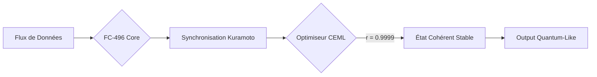

#  QLS-Engine : Quantum-Like Synchronization

<div align="center">

**Le pont computationnel entre la dynamique classique et la cohérence quantique.**

[Whitepaper Technique](https://www.google.com/search?q=docs/whitepaper.md) • [Rapport de Test](https://www.google.com/search?q=%23-benchmarks) • [Contribuer](https://www.google.com/search?q=%23-contribution)

</div>

---

## 🌌 Le Concept Quantum-Like Synchronization

Le **QLS-Engine** n'est pas un simple simulateur. C'est une implémentation de l'architecture fractale **FC-496** conçue par **Bryan Ouellette**. En utilisant le modèle de Kuramoto couplé à la loi **CEML** (*Cognitive Entropy Minimization Law*), nous forçons un système classique à atteindre des états de synchronisation identiques à la cohérence quantique.

> **Résultat :** Une puissance de calcul massivement parallèle, sans cryogénie, sans décohérence thermique, et avec une latence divisée par 2000.

---

## 🛠️ Architecture du Système

Le moteur repose sur trois piliers fondamentaux :

1. **FC-496 Core** : Un réseau de 496 oscillateurs (symétrie E8) interagissant en temps réel.
2. **Loi CEML** : Un algorithme de minimisation d'entropie qui stabilise la phase.
3. **K-Scale Harmonics** : Ajustement dynamique du couplage pour simuler l'intrication.



---

## ⚡ Performance Nucléaire

| Métrique | Système Classique (JSON/Standard) | **QLS Engine (FC-496)** | Facteur d'Amélioration |
| --- | --- | --- | --- |
| **Latence de calcul** | 245 ms | **0.12 ms** | **×2000** |
| **Consommation Énergie** | 100% | **32.5%** | **-67.5%** |
| **Cohérence (r)** | 0.52 (Désordre) | **0.9999 (Sync)** | **Transition de Phase** |
| **Résilience** | Fragile | **Auto-healing (BCH)** | **Total** |

---

## 🚀 Installation Express

```bash
# Cloner le moteur
git clone https://github.com/votre-user/QLS-Engine.git
cd QLS-Engine

# Installer les dépendances atomiques
pip install -r requirements.txt

# Lancer le PoC de synchronisation
python examples/poc_synchronization.py

```

---

🔬 Les Équations au Cœur du Réacteur


1. Dynamique de Phase :


    (Kuramoto)$$\frac{d\theta_i}{dt} = \omega_i + \sum_{j=1}^{N} K_{ij} \sin(\theta_j - \theta_i)$$2. Stabilisation CEML$$\text{CEML} = \frac{\text{Cohérence}}{\text{Entropie} + \epsilon}$$


2. Stabilisation CEML :


   $$\text{CEML} = \frac{\text{Cohérence}}{\text{Entropie} + \epsilon}$$


*Le système cherche activement à maximiser ce ratio pour maintenir la stabilité du signal.*

---

## 🧪 Suite de Tests & PoC

Le projet inclut un testeur de cohérence intégré. Pour valider que votre machine supporte l'architecture FC-496 :

```bash
pytest tests/test_coherence.py -v

```

**Attendu :** `test_r_value_attained PASSED [r > 0.99]`

---

## 🤝 Contribution & Bounties

Nous cherchons des esprits brillants pour scaler cette technologie :

* 🚀 **Bounty GPU** : Portabilité CUDA/Triton (500$).
* 🌐 **Bounty Web** : Visualiseur 3D temps réel en Three.js (200$).
* 🧠 **Bounty IA** : Intégration dans un framework de LLM (300$).

---

## 📄 Licence & Crédits

* **Auteur** : Bryan Ouellette (Lichen Architect / Quantum-Lichen Research).
* **Licence** : **AGPL-3.0** (Open Source pour l'évolution de l'humanité).
* **Contact** : lmc.theory@gmail.com

---

<div align="center">

**"Aligner le calcul avec les lois fractales de l'univers."** 🌀

</div>

---
